# Big Picture Architecture — Módulo 9: Monitoreo de Pacientes

High-level view of every component, data flow, and integration boundary.

> **Messaging model:** M9 integrates with sibling modules through the **Module 10 (Core) RabbitMQ event bus**, not through AWS SQS/SNS. Inbound events arrive on the `monitoring.requests` queue (listened to directly on RabbitMQ); outbound events are published by calling the Core (`POST /events/log`). See [`shared_docs/comunicacion-tutorial.md`](./shared_docs/comunicacion-tutorial.md).

---

## Full System Architecture

```mermaid
flowchart TB
    %% ── External Actors ──────────────────────────────────────────────
    Nurse(["👩‍⚕️ Nurse / Physician\n(Web Browser)"])
    IoT(["🏥 IoT Vital-Signs Sensors\nPhilips IntelliVue · GE"])

    M10(["Module 10 — Core\nJWT Issuer + Event Bus\napi.healthcare.cantero.ar"])
    M6(["Module 6 — Internación\nAdmission Module"])

    %% ── Core-managed messaging (RabbitMQ) ────────────────────────────
    subgraph CoreBus["Module 10 — Core Event Bus"]
        CoreAPI["Core API\nPOST /events/log\n/rabbit/queues · /rabbit/bindings"]
        Rabbit[/"RabbitMQ\nhealth_grid_exchange (topic)\nqueue.healthgrid.cantero.ar"/]
        Q_MON[/"monitoring.requests\n(+ .dlq)"/]
        Q_M6[/"internacion.requests\n(+ .dlq)"/]
        CoreAPI -->|publish| Rabbit
        Rabbit --> Q_MON
        Rabbit --> Q_M6
    end

    %% ── AWS Public Layer ─────────────────────────────────────────────
    subgraph AWS["☁️  AWS  us-east-1"]
        subgraph Edge["Public edge"]
            CF["CloudFront\ndefault → S3 · /api/* → ALB"]
            ALB["Application Load Balancer\nHTTP · WebSocket passthrough"]
        end

        %% ── Frontend ─────────────────────────────────────────────────
        subgraph FE["React 19 SPA — appvalen  (S3 static · Vite build)"]
            direction TB
            LoginPage["Login Page\n/login"]
            MonView["Monitoring View\n/monitoring — patient list"]
            DetailView["PatientDetail View\n/patients/:id — charts + alerts"]
            WSClient["STOMP / SockJS Client\nsubscribes /topic/monitoring/{id}"]
            AuthCtx["AuthContext\nJWT in localStorage\nforce-redirect on 401"]
        end

        %% ── Backend ─────────────────────────────────────────────────
        subgraph BE["Spring Boot 3.3 · ECS Fargate · port 8080 · /api/v1"]
            direction TB

            subgraph Security["Security (cross-cutting)"]
                JwtFilter["JwtAuthenticationFilter\nvalidates Bearer token"]
                JwtProv["JwtTokenProvider\nCore JWKS validation"]
                AuthCtl["AuthenticationController\nGET /auth/me"]
            end

            subgraph Inbound["Inbound paths"]
                direction LR
                REST["REST Controllers\nPatientController · RuleController\nAlertController · MonitoringController\nTelemetryReadingController"]
                WHCtl["InternacionWebhookController\nPOST /webhooks/internacion/*\n(legacy, en transición)"]
                STOMPBroker["STOMP Broker (in-memory)\n/topic/monitoring/{patientId}"]
                AdmCons["AdmissionEventListener\n@RabbitListener\n← monitoring.requests"]
                Simulator["TelemetrySimulatorService\n@Scheduled · every 3 s\n(disabled in prod)"]
                TeleProc["TelemetryConsumer\nprocessTelemetryMessage()\n(internal, no broker)"]
            end

            subgraph Domain["Service / Domain layer"]
                direction TB
                PatSvc["PatientService"]
                AdmSvc["MonitoringAdmissionService\nalta / baja"]
                TeleSvc["TelemetryReadingService"]
                RuleSvc["RuleService"]
                AlertSvc["AlertService"]
                RuleEng["RuleEngineService\n10-min lookback window\noperators: >, >=, <, <=, ==, !="]
                EvtPub["EventPublisherService\nCore /events/log (id 16/17)\n+ legacy M6 webhook"]
                CorePub["CoreEventPublisher\n+ CoreAuthService\n(service-account login)"]
            end

            subgraph DataLayer["Data access (all JPA / Spring Data)"]
                direction LR
                PatRepo[("PatientRepository")]
                RuleRepo[("RuleRepository")]
                AlertRepo[("AlertRepository")]
                TeleRepo[("TelemetryReadingRepository")]
            end
        end

        %% ── AWS Data ─────────────────────────────────────────────────
        subgraph PrivNet["Managed data store"]
            RDS[("RDS PostgreSQL 16\ndb.t3.micro\npatients · rules · alerts\ntelemetry_readings · users")]
        end

        Secrets["Secrets Manager\nDB credentials · JWT"]
        CW["CloudWatch Logs + Metrics\n/ecs/m9-monitoring"]
        ECR["ECR\nhealth-grid/m9-monitoring"]
    end

    %% ── Flow: User → Frontend → Backend ─────────────────────────────
    Nurse -->|"HTTPS dashboard"| CF
    CF -->|"default behavior"| FE
    CF -->|"/api/* proxy"| ALB
    ALB --> BE

    LoginPage --> AuthCtx
    MonView --> WSClient
    DetailView --> WSClient
    AuthCtx -->|"POST /auth/login"| M10
    M10 -->|"JWT + user"| AuthCtx

    FE -->|"REST · Authorization: Bearer JWT"| ALB
    WSClient -->|"SockJS CONNECT /api/v1/ws"| STOMPBroker

    JwtFilter --> REST
    JwtFilter --> WHCtl

    %% ── Flow: Telemetry (internal, no broker) ───────────────────────
    IoT -. "future: in-process ingestion" .-> TeleProc
    Simulator -->|"fabricated readings"| TeleProc
    TeleProc --> TeleSvc
    TeleProc --> RuleEng

    %% ── Flow: M6 admission → Core bus → Backend ─────────────────────
    M6 -->|"POST /events/log (alta/baja monitoreo)"| CoreAPI
    Q_MON -->|"deliver over RabbitMQ"| AdmCons
    AdmCons --> AdmSvc
    AdmSvc --> PatSvc
    M6 -. "legacy webhook /webhooks/internacion/*" .-> WHCtl
    WHCtl --> AdmSvc

    %% ── Flow: Internal Domain ─────────────────────────────────────────
    REST --> PatSvc
    REST --> RuleSvc
    REST --> AlertSvc
    REST --> TeleSvc
    TeleSvc --> RuleEng
    RuleEng --> AlertSvc
    AlertSvc --> EvtPub

    %% ── Flow: Alert Fan-out ───────────────────────────────────────────
    EvtPub -->|"① WebSocket push"| STOMPBroker
    STOMPBroker -->|"real-time alert frame"| WSClient
    EvtPub -->|"② Core event bus"| CorePub
    CorePub -->|"POST /events/log (id 16/17)"| CoreAPI
    Q_M6 -->|"deliver over RabbitMQ"| M6
    EvtPub -. "③ legacy direct webhook" .-> M6

    %% ── Flow: Data Persistence (all Postgres) ─────────────────────────
    PatSvc --> PatRepo --> RDS
    RuleSvc --> RuleRepo --> RDS
    AlertSvc --> AlertRepo --> RDS
    TeleSvc --> TeleRepo --> RDS
    RuleEng -->|"Query last 10 min"| TeleRepo

    %% ── JWT Validation boundary ──────────────────────────────────────
    M10 -->|"JWKS / RS256"| JwtProv

    %% ── Ops ──────────────────────────────────────────────────────────
    BE -. "read secrets" .-> Secrets
    BE -. "logs" .-> CW
    ECR -. "image pull" .-> BE

    %% ── Styles ───────────────────────────────────────────────────────
    classDef ext    fill:#eef,stroke:#669,stroke-width:1.5px,color:#333
    classDef store  fill:#fff8dc,stroke:#a80,stroke-width:1.5px
    classDef queue  fill:#e0f7ff,stroke:#0a7,stroke-width:1.5px
    classDef fe     fill:#fef3e2,stroke:#d80,stroke-width:1px
    classDef be     fill:#e8f5e9,stroke:#2a7,stroke-width:1px
    classDef ops    fill:#f5f5f5,stroke:#888,stroke-width:1px,stroke-dasharray:4 2

    class Nurse,IoT,M6,M10 ext
    class RDS,PatRepo,RuleRepo,AlertRepo,TeleRepo store
    class Rabbit,Q_MON,Q_M6,STOMPBroker,CoreAPI queue
    class LoginPage,MonView,DetailView,WSClient,AuthCtx fe
    class REST,WHCtl,AdmCons,TeleProc,Simulator,PatSvc,AdmSvc,TeleSvc,RuleSvc,AlertSvc,RuleEng,EvtPub,CorePub,JwtFilter,JwtProv,AuthCtl be
    class Secrets,CW,ECR ops
```



---

## Key Data Flows (summary)

| Flow | Path |
|------|------|
| **Nurse opens dashboard** | Browser → CloudFront → S3 (SPA) + `/api/*` → ALB → REST `/patients/monitoring` + STOMP subscribe |
| **Login / token** | SPA → Core `/auth/login` → Core-issued JWT → localStorage → M9 validates via JWKS |
| **Telemetry (internal)** | Simulator (or in-process sensor path) → `TelemetryConsumer.processTelemetryMessage` → TelemetryReadingService → Postgres. **Does not traverse the Core bus.** |
| **Rule evaluation** | TelemetryConsumer → RuleEngineService (10-min Postgres lookback) → AlertService → EventPublisherService |
| **Alert fan-out** | AlertService → ① Postgres persist ② STOMP push to SPA ③ Core `POST /events/log` (ids 16/17) → RabbitMQ → M6 · ④ legacy M6 webhook (transition) |
| **Admission event (bus)** | M6 → Core `POST /events/log` → RabbitMQ `monitoring.requests` → AdmissionEventListener → MonitoringAdmissionService |
| **Admission event (legacy)** | M6 → `POST /webhooks/internacion/{alta,baja}-monitoreo` → InternacionWebhookController → MonitoringAdmissionService |

---

## Persistence at a Glance

All domain data lives in **RDS PostgreSQL** (single store, JPA/Hibernate, `ddl-auto: update`).

| Entity | Store | Notes |
|--------|-------|-------|
| Patient, Rule, Alert, User | **RDS PostgreSQL** | Relational, complex queries (filter by status, severity, room) |
| TelemetryReading (vital signs) | **RDS PostgreSQL** (`telemetry_readings`) | JPA entity; the 10-min lookback is an indexed range query by `patient` + `recordedAt` |

> There is **no DynamoDB** and **no SNS/SQS** in the running system. Earlier drafts of these docs described a DynamoDB + SNS/SQS design that was never shipped; the code has always used Postgres, and messaging now goes through the Core RabbitMQ bus.

**Timestamps:** every wall-clock read uses **UTC** (`LocalDateTime.now(ZoneOffset.UTC)`) — telemetry `recordedAt`, alert `triggeredAt`/`acknowledgedAt`, and the outbound M6 payloads (serialized with a `Z` suffix), so the cross-module timestamp contract and the lookback window stay correct regardless of server timezone.

---

## Module Boundaries

```
M10 Core ──── issues JWT (validated via JWKS) · hosts the RabbitMQ event bus (publish via /events/log, provision via /rabbit/*)
M6 Internación ── sends alta/baja monitoreo IN (Core bus or legacy webhook) · receives emergency/resolved alerts OUT (Core bus ids 16/17 + legacy webhook)
M9 (this service) ── owns monitoring, rules, alerts, real-time dashboard; telemetry is internal
```

> **Infra note (follow-up):** the CDK stack (`infrastructure/cdk/lib/m9-backend-stack.ts`) still provisions three SQS queues (`telemetry-readings-queue`, `patient-events-queue`, `admission-events-queue`) and passes `AWS_SQS_*` env vars. These are **orphaned** — the application no longer consumes or produces to SQS. They should be removed from the stack and the task's runtime config replaced with `RABBITMQ_*` / `MODULE10_CORE_*` variables.
