# Big Picture Architecture — Módulo 9: Monitoreo de Pacientes

High-level view of every component, data flow, and integration boundary.

---

## Full System Architecture

```mermaid
flowchart TB
    %% ── External Actors ──────────────────────────────────────────────
    Nurse(["👩‍⚕️ Nurse / Physician\n(Web Browser)"])
    IoT(["🏥 IoT Vital-Signs Sensors\nPhilips IntelliVue · GE"])

    M10(["Module 10 — Core\nJWT Issuer"])
    M6(["Module 6 — Internación\nAdmission Module"])
    M8(["Module 8 — Patient Portal"])

    %% ── AWS Public Layer ─────────────────────────────────────────────
    subgraph AWS["☁️  AWS  us-east-1"]
        Route53["Route 53 (DNS)"]
        ACM["ACM TLS cert"]

        subgraph PubNet["Public Subnet"]
            ALB["Application Load Balancer\nHTTPS 443 · WebSocket passthrough"]
        end

        %% ── Frontend ─────────────────────────────────────────────────
        subgraph FE["React 19 SPA — appvalen  (Vite · port 5173)"]
            direction TB
            LoginPage["Login Page\n/login"]
            MonView["Monitoring View\n/monitoring — patient list"]
            DetailView["PatientDetail View\n/patients/:id — charts + alerts"]
            WSClient["STOMP / SockJS Client\nsubscribes /topic/monitoring/{id}"]
            AuthCtx["AuthContext\nJWT stored in localStorage\nforce-redirect on 401"]
        end

        %% ── Backend ─────────────────────────────────────────────────
        subgraph BE["Spring Boot 3.3 · ECS Fargate · port 8080 · /api/v1"]
            direction TB

            subgraph Security["Security (cross-cutting)"]
                JwtFilter["JwtAuthenticationFilter\nvalidates Bearer token on every request"]
                JwtProv["JwtTokenProvider\nHS512 · 24 h TTL"]
                AuthCtl["AuthenticationController\nPOST /auth/token\n(simulates M10 — temporary)"]
            end

            subgraph Inbound["Inbound paths"]
                direction LR
                REST["REST Controllers\nPatientController\nRuleController · AlertController\nMonitoringController\nTelemetryReadingController"]
                WHCtl["InternacionWebhookController\nPOST /webhook/admission"]
                STOMPBroker["STOMP Broker (in-memory)\n/topic/monitoring/{patientId}"]
                TeleCons["TelemetryConsumer\nSpring Cloud Stream\n← telemetry-readings-queue"]
                PatCons["PatientEventConsumer\nSpring Cloud Stream\n← patient-events-queue"]
                Simulator["TelemetrySimulatorService\n@Scheduled · every 3 s\n(disabled in prod)"]
            end

            subgraph Domain["Service / Domain layer"]
                direction TB
                PatSvc["PatientService"]
                TeleSvc["TelemetryReadingService"]
                RuleSvc["RuleService"]
                AlertSvc["AlertService"]
                RuleEng["RuleEngineService\n10-min lookback window\noperators: >, >=, <, <=, ==, !="]
                EvtPub["EventPublisherService\nSNS publish + M6 webhook"]
            end

            subgraph DataLayer["Data access"]
                direction LR
                PatRepo[("PatientRepository\nJPA / Spring Data")]
                RuleRepo[("RuleRepository\nJPA / Spring Data")]
                AlertRepo[("AlertRepository\nJPA / Spring Data")]
                TeleDao[("TelemetryReadingDao\nDynamoDB Enhanced Client")]
            end
        end

        %% ── AWS Data & Messaging ─────────────────────────────────────
        subgraph PrivNet["Private Subnet / Managed Services"]
            RDS[("RDS PostgreSQL 16\ndb.t3.micro\npatients · rules · alerts · users")]
            DDB[("DynamoDB\nm9-telemetry-readings\nPK patient_id · SK recorded_at\nTTL 90 days")]
        end

        subgraph Messaging["Messaging"]
            SQS_T[/"SQS  telemetry-readings-queue\n(ingest from IoT)"/]
            SQS_P[/"SQS  patient-events-queue\n(admission events)"/]
            SNS[/"SNS  monitoring-events\n(alert fan-out)"/]
            SQS_M6[/"SQS  m6-monitoring-sub"/]
            SQS_M8[/"SQS  m8-monitoring-sub"/]
        end

        Secrets["Secrets Manager\nDB credentials · JWT secret"]
        CW["CloudWatch Logs + Metrics\n/ecs/m9-monitoring"]
        ECR["ECR\nhealth-grid/m9-monitoring"]
    end

    %% ── Flow: User → Frontend → Backend ─────────────────────────────
    Nurse -->|"HTTPS dashboard"| Route53 --> ALB
    ACM -. TLS .-> ALB
    ALB --> FE
    ALB --> BE

    LoginPage --> AuthCtx
    MonView --> WSClient
    DetailView --> WSClient
    AuthCtx -->|"POST /auth/token"| AuthCtl
    AuthCtl --> JwtProv

    FE -->|"REST · Authorization: Bearer JWT"| ALB
    WSClient -->|"SockJS CONNECT /api/v1/ws"| STOMPBroker

    JwtFilter --> REST
    JwtFilter --> WHCtl

    %% ── Flow: IoT → SQS → Backend ────────────────────────────────────
    IoT -->|"JSON telemetry ~1 Hz per patient"| SQS_T
    TeleCons -->|"long-poll consume"| SQS_T
    Simulator -->|"fabricated readings"| TeleSvc

    %% ── Flow: M6 → Backend ───────────────────────────────────────────
    M6 -->|"admission events"| SQS_P
    PatCons -->|"long-poll consume"| SQS_P
    M6 -->|"webhook admission"| WHCtl

    %% ── Flow: Internal Domain ─────────────────────────────────────────
    TeleCons --> TeleSvc
    TeleCons --> RuleEng
    PatCons --> PatSvc
    WHCtl --> PatSvc
    REST --> PatSvc
    REST --> RuleSvc
    REST --> AlertSvc
    REST --> TeleSvc

    TeleSvc --> RuleEng
    RuleEng --> AlertSvc
    AlertSvc --> EvtPub

    %% ── Flow: Alert Fan-out ───────────────────────────────────────────
    EvtPub -->|"2a. WebSocket push"| STOMPBroker
    STOMPBroker -->|"real-time alert frame"| WSClient
    EvtPub -->|"2b. SNS publish"| SNS
    SNS --> SQS_M6 --> M6
    SNS --> SQS_M8 --> M8
    EvtPub -. "optional direct webhook" .-> M6

    %% ── Flow: Data Persistence ────────────────────────────────────────
    PatSvc --> PatRepo --> RDS
    RuleSvc --> RuleRepo --> RDS
    AlertSvc --> AlertRepo --> RDS
    TeleSvc --> TeleDao --> DDB
    RuleEng -->|"Query last 10 min"| TeleDao

    %% ── JWT Validation boundary ──────────────────────────────────────
    M10 -. "Future: real JWT issuer\n(JWKS / RS256)" .-> JwtProv

    %% ── Ops ──────────────────────────────────────────────────────────
    BE -. "read secrets" .-> Secrets
    BE -. "logs" .-> CW
    ECR -. "image pull" .-> BE

    %% ── Styles ───────────────────────────────────────────────────────
    classDef ext    fill:#eef,stroke:#669,stroke-width:1.5px,color:#333
    classDef store  fill:#fff8dc,stroke:#a80,stroke-width:1.5px
    classDef queue  fill:#e0f7ff,stroke:#0a7,stroke-width:1.5px
    classDef fe     fill:#fef3e2,stroke:#d80,stroke-width:1px
    classDef be     fill:#e8f5e9,stroke:#2a7,stroke-width:1px
    classDef ops    fill:#f5f5f5,stroke:#888,stroke-width:1px,stroke-dasharray:4 2

    class Nurse,IoT,M6,M8,M10 ext
    class RDS,DDB,PatRepo,RuleRepo,AlertRepo,TeleDao store
    class SQS_T,SQS_P,SNS,SQS_M6,SQS_M8,STOMPBroker queue
    class LoginPage,MonView,DetailView,WSClient,AuthCtx fe
    class REST,WHCtl,TeleCons,PatCons,Simulator,PatSvc,TeleSvc,RuleSvc,AlertSvc,RuleEng,EvtPub,JwtFilter,JwtProv,AuthCtl be
    class Secrets,CW,ECR ops
```



---

## Key Data Flows (summary)

| Flow | Path |
|------|------|
| **Nurse opens dashboard** | Browser → Route 53 → ALB → React SPA → REST `/patients/monitoring` + STOMP subscribe |
| **Login / token** | SPA → `POST /auth/token` → JwtTokenProvider (HS512) → JWT → localStorage |
| **IoT telemetry** | Sensor → SQS `telemetry-readings-queue` → TelemetryConsumer → TelemetryReadingService → DynamoDB |
| **Rule evaluation** | TelemetryConsumer → RuleEngineService (10-min DynamoDB lookback) → AlertService → EventPublisherService |
| **Alert fan-out** | AlertService → ① Postgres persist ② STOMP push to SPA ③ SNS → SQS → M6 / M8 |
| **Admission event** | M6 → SQS `patient-events-queue` → PatientEventConsumer → PatientService |
| **Direct admission webhook** | M6 → `POST /webhook/admission` → InternacionWebhookController → PatientService |

---

## Polyglot Persistence at a Glance

| Entity | Store | Reason |
|--------|-------|--------|
| Patient, Rule, Alert, User | **RDS PostgreSQL** | Relational, low write rate, complex queries |
| TelemetryReading (vital signs ~1 Hz) | **DynamoDB** | High write throughput, single-key `Query` by `patient_id + recorded_at`, auto-purge via TTL |

---

## Module Boundaries

```
M10 Core ──── issues JWT tokens (currently simulated inside M9 via AuthenticationController)
M6 Internación ── sends admission events IN  ·  receives emergency-alert webhooks + SNS events OUT
M8 Patient Portal ── receives patient-state events via SNS → SQS
M9 (this service) ── owns monitoring, rules, alerts, real-time dashboard
```
