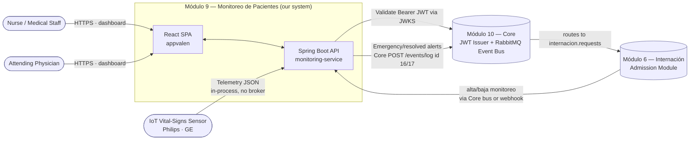
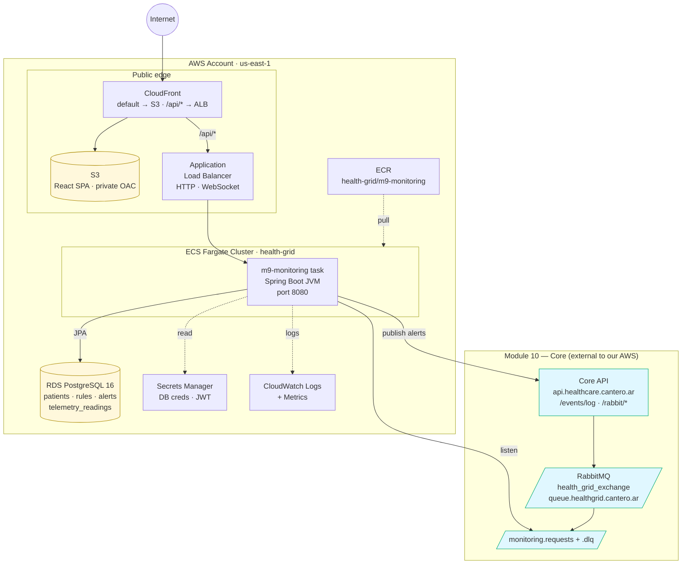
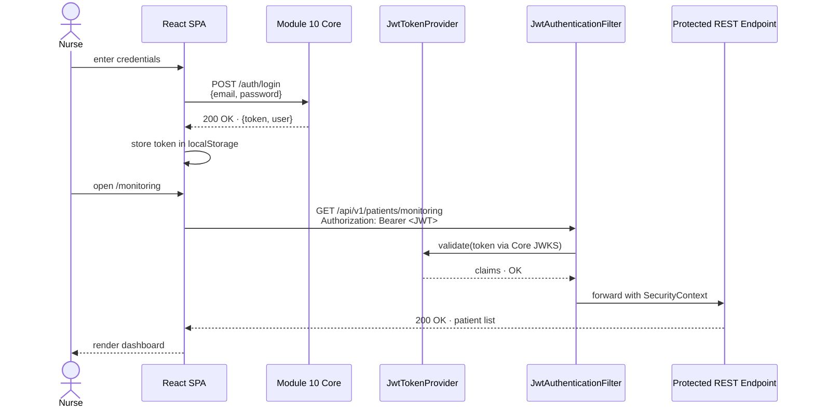
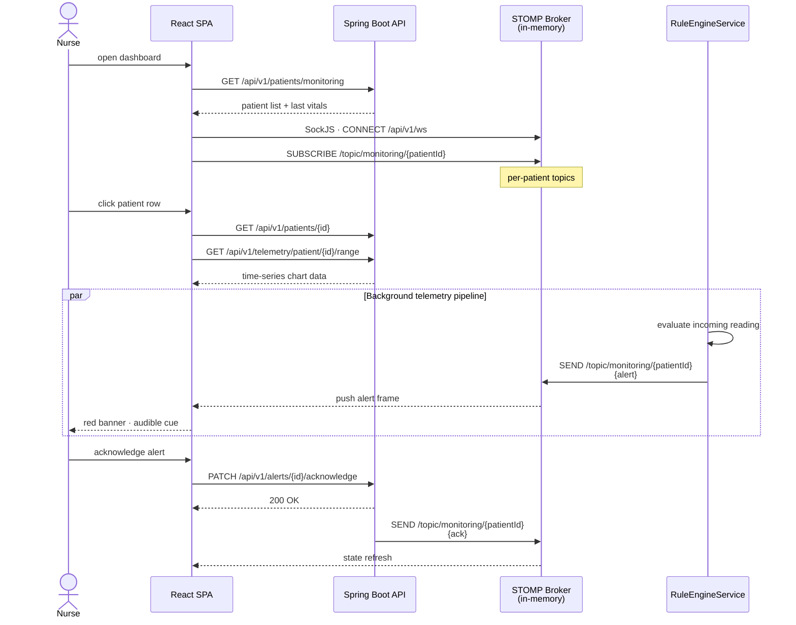
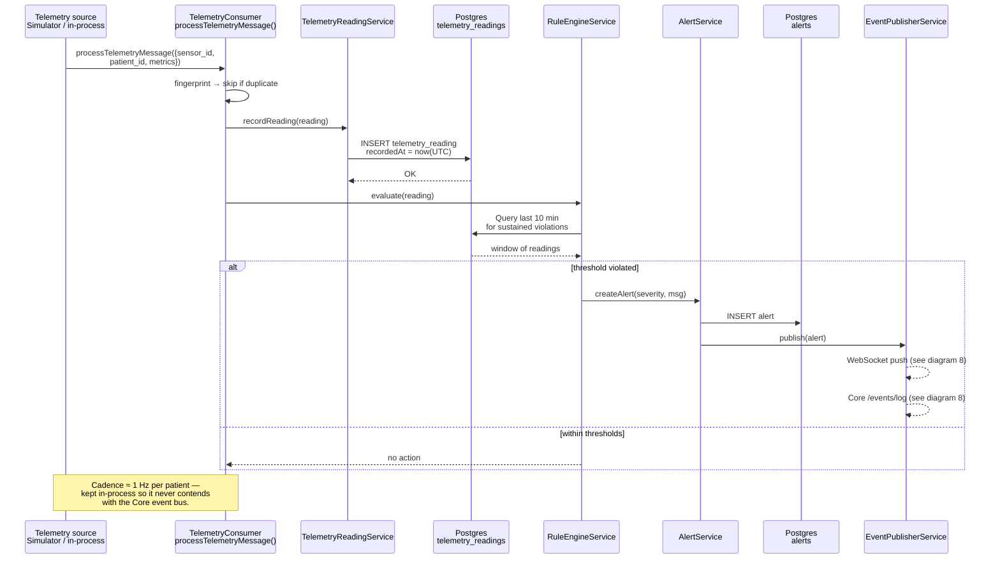
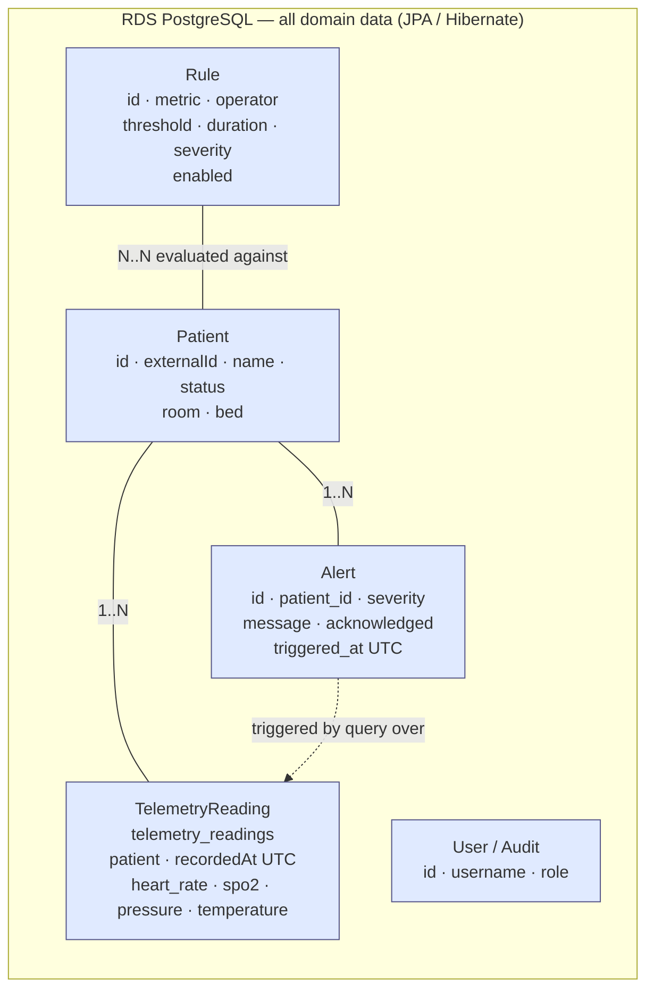

# Architecture Diagrams — Módulo 9: Monitoreo de Pacientes

Visual companion to [`aws-deployment-guide.md`](./aws-deployment-guide.md). Each diagram answers one question; read in order or jump to the one you need.

| # | Diagram | Question it answers |
|---|---|---|
| 1 | [System context](#1-system-context) | Who talks to M9? |
| 2 | [AWS deployment topology](#2-aws-deployment-topology) | Where does each piece run? |
| 3 | [Backend application layers](#3-backend-application-layers) | How is the Spring Boot service structured internally? |
| 4 | [Authentication (JWT) sequence](#4-authentication-jwt-sequence) | How does a nurse get a token? |
| 5 | [Real-time monitoring user journey](#5-real-time-monitoring-user-journey) | What happens when a nurse opens the dashboard? |
| 6 | [Telemetry ingestion & rule evaluation](#6-telemetry-ingestion--rule-evaluation) | How does a sensor reading become an alert? |
| 7 | [Persistence split: Postgres vs DynamoDB](#7-persistence-split-postgres-vs-dynamodb) | What data lives in which store? |
| 8 | [Alert fan-out](#8-alert-fan-out) | Once an alert exists, who hears about it? |

---

## 1. System context

M9 lives in a "modules" landscape (M6 Internación, M10 Core). Its boundaries are: people (medical staff), medical devices (IoT sensors), and the sibling modules. Everything inside the dashed box is what *we* build and operate. Cross-module messaging goes through the **Core RabbitMQ event bus** (publish via `POST /events/log`, consume from our `monitoring.requests` queue) — there is no AWS SQS/SNS in the running system.



---

## 2. AWS deployment topology

Where each box from diagram 1 actually runs. The public edge (CloudFront + ALB) and the ECS task live in AWS; **RabbitMQ and the event bus are hosted by Module 10 (Core)**, reached over the network — M9 provisions no queues of its own in AWS. Persistence is a single RDS PostgreSQL instance.



> **Infra follow-up:** the CDK (`infrastructure/cdk/lib/m9-backend-stack.ts`) still provisions three now-unused SQS queues and `AWS_SQS_*` env vars — pending removal in favour of `RABBITMQ_*` / `MODULE10_CORE_*`.

---

## 3. Backend application layers

Inside a single Spring Boot task, the code is organised by role. Inbound paths (REST, RabbitMQ listener, scheduled simulator, legacy webhook) all converge on the same service layer.

```mermaid
flowchart TB
    subgraph Inbound["Inbound paths into the same domain"]
        REST[REST Controllers<br/>PatientController<br/>RuleController<br/>AlertController<br/>MonitoringController<br/>TelemetryReadingController]
        WS[WebSocket Endpoint<br/>STOMP · SockJS<br/>/api/v1/ws]
        Adm[AdmissionEventListener<br/>@RabbitListener<br/>monitoring.requests]
        Tele[TelemetryConsumer<br/>processTelemetryMessage]
        Sim[Scheduled Job<br/>TelemetrySimulatorService<br/>simulator.enabled]
        WH[Webhook Receiver<br/>InternacionWebhookController<br/>legacy]
    end

    subgraph CrossCut["Cross-cutting"]
        SecF[JwtAuthenticationFilter<br/>+ SecurityConfig]
        WSCfg[WebSocketConfig<br/>broker /topic]
    end

    subgraph Domain["Service / Domain layer"]
        PatientSvc[PatientService]
        AdmSvc[MonitoringAdmissionService]
        TeleSvc[TelemetryReadingService]
        RuleSvc[RuleService]
        AlertSvc[AlertService]
        RuleEng[RuleEngineService<br/>10-min lookback]
        EvtPub[EventPublisherService<br/>Core /events/log + M6 webhook]
        CorePub[CoreEventPublisher<br/>+ CoreAuthService]
        JwtP[JwtTokenProvider<br/>Core JWKS]
    end

    subgraph Data["Data layer · all JPA / Postgres"]
        PatRepo[(PatientRepository)]
        RuleRepo[(RuleRepository)]
        AlertRepo[(AlertRepository)]
        TeleRepo[(TelemetryReadingRepository)]
    end

    REST --> SecF --> PatientSvc
    SecF --> TeleSvc
    SecF --> RuleSvc
    SecF --> AlertSvc
    WS --> WSCfg
    Adm --> AdmSvc --> PatientSvc
    Sim --> Tele --> TeleSvc
    Tele --> RuleEng
    WH --> AdmSvc

    TeleSvc --> RuleEng
    RuleEng --> AlertSvc
    AlertSvc --> EvtPub
    EvtPub --> WSCfg
    EvtPub --> CorePub

    PatientSvc --> PatRepo
    RuleSvc --> RuleRepo
    AlertSvc --> AlertRepo
    TeleSvc --> TeleRepo
    RuleEng --> TeleRepo

    REST -.token check.-> JwtP
    SecF -.validate.-> JwtP

    classDef inbound fill:#fef3e2,stroke:#d80;
    classDef domain fill:#e8f5e9,stroke:#2a7;
    classDef data fill:#fff8dc,stroke:#a80;
    class REST,WS,Adm,Tele,Sim,WH inbound;
    class PatientSvc,AdmSvc,TeleSvc,RuleSvc,AlertSvc,RuleEng,EvtPub,CorePub,JwtP domain;
    class PatRepo,RuleRepo,AlertRepo,TeleRepo data;
```

---

## 4. Authentication (JWT) sequence

How a nurse's browser gets a token from Module 10 (Core), then uses it against the monitoring service.



---

## 5. Real-time monitoring user journey

Once authenticated, the SPA combines REST snapshots (initial list) with a STOMP WebSocket subscription (live alerts). This is the path a nurse follows from login to acknowledging an alert.



---

## 6. Telemetry ingestion & rule evaluation

The hot path that runs every few seconds, per patient. Telemetry is **internal** — it never leaves the process on a broker. Today `TelemetrySimulatorService` feeds it; in production an equivalent in-process ingestion path would. Only the resulting alerts go outward (diagram 8).



---

## 7. Persistence: single Postgres store

All entities — including high-frequency telemetry — live in one **RDS PostgreSQL** instance via JPA/Hibernate. There is no DynamoDB; telemetry readings are a regular JPA entity with an index on `(patient, recordedAt)` that serves the rule-engine lookback.



**Query patterns at a glance**

| Use case | Operation |
|---|---|
| List active patients in ICU | `SELECT … WHERE status='CRITICAL'` |
| Show patient profile | `findById` |
| Last 10 min of vitals for rule eval | `findByPatientAndRecordedAtAfter(...)` (indexed range) |
| Telemetry chart on PatientDetail | `findByPatientAndRecordedAtBetween(t1, t2)` |
| List unacknowledged alerts | `SELECT … WHERE acknowledged=false` |
| Old telemetry cleanup | Scheduled purge / retention job (no TTL infra) |

---

## 8. Alert fan-out

Once `RuleEngineService` produces an `Alert`, it goes three places at once: persisted, pushed to the nursing dashboard in real time, and published to the SNS topic for sibling modules.

```mermaid
flowchart LR
    RE[RuleEngineService] --> AlertSvc[AlertService]
    AlertSvc -->|1. persist| PG[(Postgres · alert)]
    AlertSvc --> Pub[EventPublisherService]

    Pub -->|2a. real-time push| WS[STOMP Broker<br/>/topic/monitoring/&#123;id&#125;]
    WS --> SPA[Nurse SPA<br/>banner + sound]

    Pub -->|2b. publish event| SNS[/SNS<br/>monitoring-events/]
    SNS --> Q1[/SQS m6-monitoring-sub/]
    SNS --> Q2[/SQS m8-monitoring-sub/]
    Q1 --> M6[Módulo 6<br/>Internación]
    Q2 --> M8[Módulo 8<br/>Patient Portal]

    Pub -.optional direct webhook.-> M6

    classDef store fill:#fff8dc,stroke:#a80;
    classDef queue fill:#e0f7ff,stroke:#0a7;
    classDef ext fill:#eef,stroke:#669;
    class PG store;
    class SNS,Q1,Q2,WS queue;
    class M6,M8,SPA ext;
```



**Delivery guarantees per channel**

| Channel | Latency | Retry | If subscriber down |
|---|---|---|---|
| WebSocket push | < 100 ms | None — fire-and-forget | Alert lost for that session (DB still has it; SPA refetches on reconnect) |
| SNS → SQS fan-out | < 1 s | SQS visibility timeout + DLQ | Message held up to 14 days in SQS |
| Direct webhook to M6 | < 500 ms | App retries 3× with backoff | Falls back to SNS path |

---

## Reading order suggestions

- **Onboarding a new dev:** 1 → 3 → 5 → 6
- **Reviewing infra/cost:** 2 → 7 → 8
- **Debugging an alert that didn't fire:** 6 → 8
- **Planning M10 cutover:** 4 (the boxed seam)
