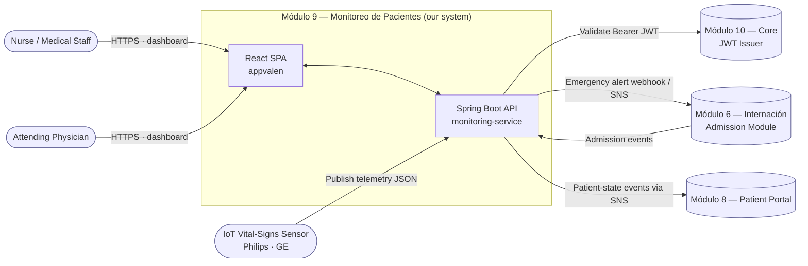
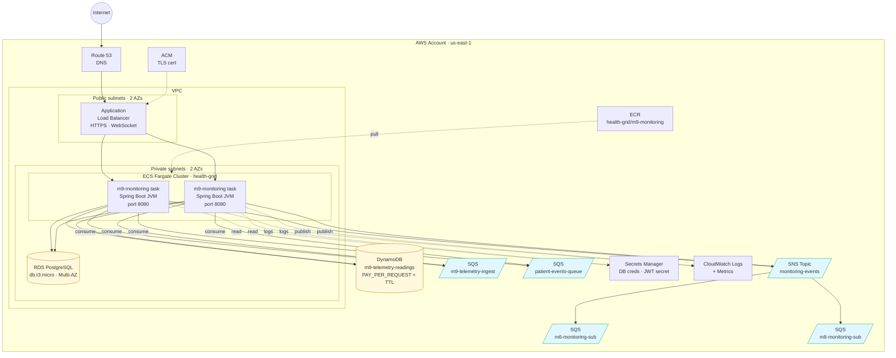
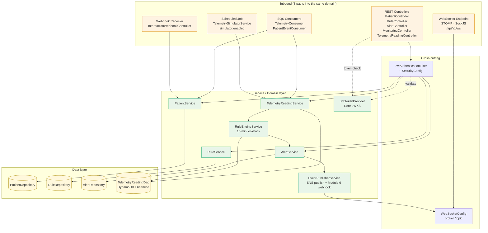
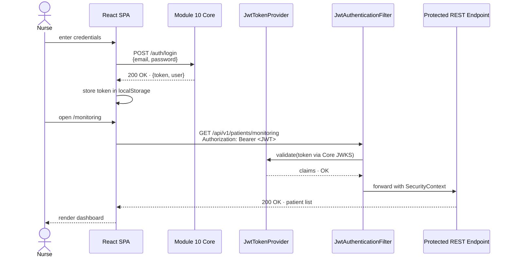
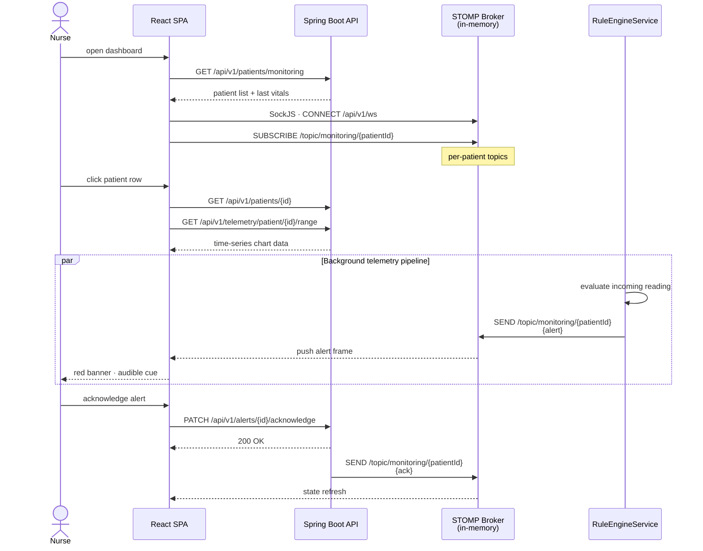
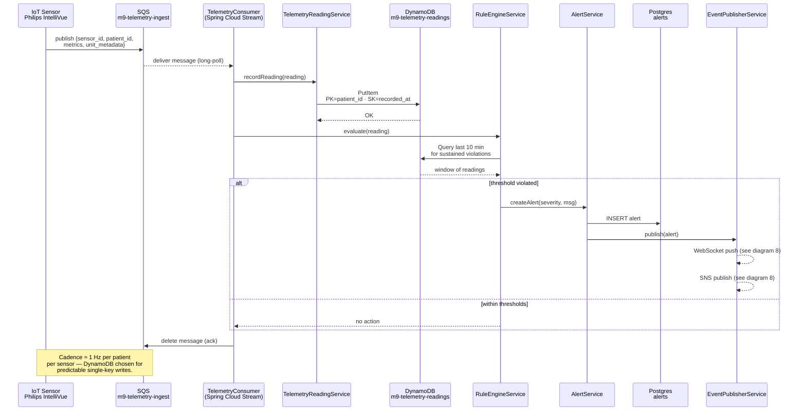
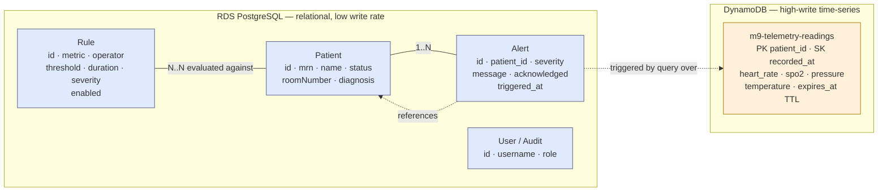

# Architecture Diagrams — Módulo 9: Monitoreo de Pacientes

Visual companion to [`aws-deployment-guide.md`](./aws-deployment-guide.md). Each diagram answers one question; read in order or jump to the one you need.

| # | Diagram | Question it answers |
|---|---|---|
| 1 | [System context](#1-system-context) | Who talks to M9? |
| 2 | [AWS deployment topology](#2-aws-deployment-topology) | Where does each piece run? |
| 3 | [Backend application layers](#3-backend-application-layers) | How is the Spring Boot service structured internally? |
| 4 | [Authentication (JWT) sequence](#4-authentication-jwt-sequence) | How does a nurse get a token? |
| 5 | [Real-time monitoring user journey](#5-real-time-monitoring-user-journey) | What happens when a nurse opens the dashboard? |
| 6 | [Telemetry ingestion & rule evaluation](#6-telemetry-ingestion--rule-evaluation) | How does a sensor reading become an alert? |
| 7 | [Persistence split: Postgres vs DynamoDB](#7-persistence-split-postgres-vs-dynamodb) | What data lives in which store? |
| 8 | [Alert fan-out](#8-alert-fan-out) | Once an alert exists, who hears about it? |

---

## 1. System context

M9 lives in a "modules" landscape (M6 Internación, M10 Core). Its boundaries are: people (medical staff), medical devices (IoT sensors), and the two sibling modules. Everything inside the dashed box is what *we* build and operate.

---

## 2. AWS deployment topology

Where each box from diagram 1 actually runs in AWS. Public-facing components (ALB) sit in public subnets; the JVM, Postgres, DynamoDB, and queues live in private subnets or are accessed via VPC endpoints.

---

## 3. Backend application layers

Inside a single Spring Boot task, the code is organised by role. Three *inbound* paths (REST, SQS, scheduled simulator) all converge on the same service layer.

---

## 4. Authentication (JWT) sequence

How a nurse's browser gets a token from Module 10 (Core), then uses it against the monitoring service.

---

## 5. Real-time monitoring user journey

Once authenticated, the SPA combines REST snapshots (initial list) with a STOMP WebSocket subscription (live alerts). This is the path a nurse follows from login to acknowledging an alert.

---

## 6. Telemetry ingestion & rule evaluation

The hot path that runs every few seconds, per patient, per sensor. Devices never talk to the API directly — they publish to SQS, which decouples device cadence from app availability.

---

## 7. Persistence split: Postgres vs DynamoDB

The polyglot rationale in one picture. Relational entities with rich queries stay in Postgres; high-write time-series go to DynamoDB.

**Query patterns at a glance**

| Use case | Store | Operation |
|---|---|---|
| List active patients in ICU | Postgres | `SELECT … WHERE status='CRITICAL'` |
| Show patient profile | Postgres | `findById` |
| Last 10 min of vitals for rule eval | DynamoDB | `Query(PK=patient_id, SK>=now-10m, Limit=N)` |
| Telemetry chart on PatientDetail | DynamoDB | `Query(PK=patient_id, SK between t1 and t2)` |
| List unacknowledged alerts | Postgres | `SELECT … WHERE acknowledged=false` |
| Old telemetry cleanup | DynamoDB | TTL on `expires_at` (no app code) |

---

## 8. Alert fan-out

Once `RuleEngineService` produces an `Alert`, it goes three places at once: persisted, pushed to the nursing dashboard in real time, and published to the SNS topic for sibling modules.

```mermaid
flowchart LR
    RE[RuleEngineService] --> AlertSvc[AlertService]
    AlertSvc -->|1. persist| PG[(Postgres · alert)]
    AlertSvc --> Pub[EventPublisherService]

    Pub -->|2a. real-time push| WS[STOMP Broker<br/>/topic/monitoring/&#123;id&#125;]
    WS --> SPA[Nurse SPA<br/>banner + sound]

    Pub -->|2b. publish event| SNS[/SNS<br/>monitoring-events/]
    SNS --> Q1[/SQS m6-monitoring-sub/]
    SNS --> Q2[/SQS m8-monitoring-sub/]
    Q1 --> M6[Módulo 6<br/>Internación]
    Q2 --> M8[Módulo 8<br/>Patient Portal]

    Pub -.optional direct webhook.-> M6

    classDef store fill:#fff8dc,stroke:#a80;
    classDef queue fill:#e0f7ff,stroke:#0a7;
    classDef ext fill:#eef,stroke:#669;
    class PG store;
    class SNS,Q1,Q2,WS queue;
    class M6,M8,SPA ext;
```

**Delivery guarantees per channel**

| Channel | Latency | Retry | If subscriber down |
|---|---|---|---|
| WebSocket push | < 100 ms | None — fire-and-forget | Alert lost for that session (DB still has it; SPA refetches on reconnect) |
| SNS → SQS fan-out | < 1 s | SQS visibility timeout + DLQ | Message held up to 14 days in SQS |
| Direct webhook to M6 | < 500 ms | App retries 3× with backoff | Falls back to SNS path |

---

## Reading order suggestions

- **Onboarding a new dev:** 1 → 3 → 5 → 6
- **Reviewing infra/cost:** 2 → 7 → 8
- **Debugging an alert that didn't fire:** 6 → 8
- **Planning M10 cutover:** 4 (the boxed seam)
