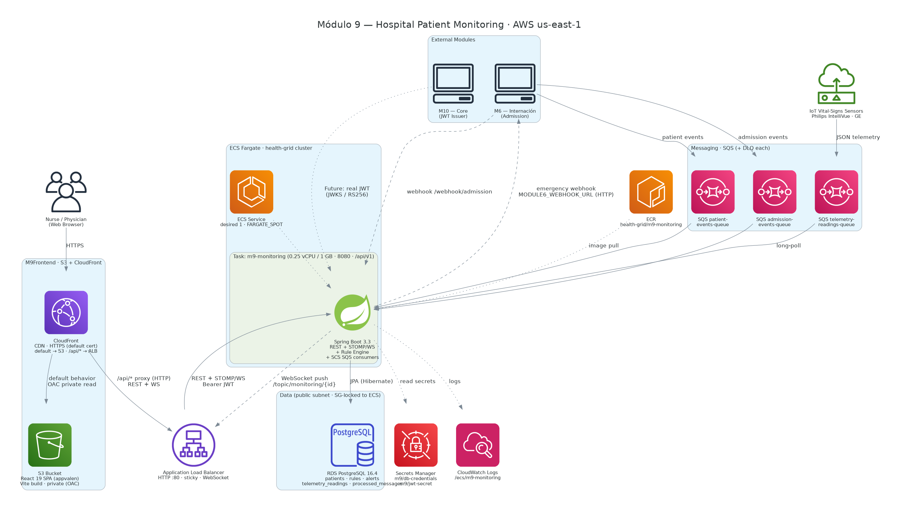

# AWS Architecture Diagram — Módulo 9

Rendered architecture diagram using the **official, colored AWS service icons**.



- `m9-aws-architecture.png` — raster image for embedding in docs/slides.
- `m9-aws-architecture.svg` — vector version (crisp at any zoom).
- `m9_architecture.py` — source of truth. Edit this and re-render; do not hand-edit the images.

## What it shows

Kept in sync with the deployed CDK stacks in
[`../../../infrastructure/cdk/lib`](../../../infrastructure/cdk/lib):

- **Frontend (`M9Frontend`):** CloudFront → private S3 bucket (Origin Access Control) serving the React SPA (`appvalen`) static Vite build. CloudFront also proxies `/api/*` to the backend ALB, so the browser talks to the API same-origin over HTTPS (viewer→CloudFront is HTTPS with the default `*.cloudfront.net` cert; CloudFront→ALB is HTTP).
- **Backend edge (`M9Backend`):** Application Load Balancer on **HTTP :80** with sticky sessions (SockJS/WebSocket fallback). No Route 53 / ACM is provisioned.
- **Compute:** ECS Fargate service (desired 1, **FARGATE_SPOT**, 0.25 vCPU / 1 GB) running the Spring Boot service (REST, STOMP/WS, rule engine, Spring Cloud Stream SQS consumers); image pulled from ECR.
- **Data:** a single **RDS PostgreSQL 16.4** instance (patients, rules, alerts, telemetry_readings, processed_messages) in a public subnet, SG-locked to the ECS tasks. There is **no DynamoDB** — telemetry readings are a JPA entity in Postgres.
- **Messaging:** three ingest **SQS** queues (`telemetry-readings-queue`, `patient-events-queue`, `admission-events-queue`), each with a dead-letter queue (maxReceiveCount 3). There is **no SNS** — alert fan-out is a WebSocket push plus an HTTP webhook to Module 6 (`MODULE6_WEBHOOK_URL`).
- **Ops:** Secrets Manager (`m9/db-credentials`, `m9/jwt-secret`), CloudWatch Logs (`/ecs/m9-monitoring`).
- **External:** IoT sensors (telemetry producers), M6 Internación (admission + patient events + webhook receiver), M10 Core (future real JWT issuer).

> Not drawn: `GithubOidc` (CI-only GitHub Actions deploy role — no runtime role in the request path).

## Re-rendering

Requires the Graphviz `dot` binary and the Python `diagrams` library:

```bash
sudo apt-get install -y graphviz          # system dependency (dot)
python3 -m venv venv && ./venv/bin/pip install diagrams

# The script writes its .png/.svg next to itself, so it can be run from anywhere:
./venv/bin/python docs/architecture/diagrams/m9_architecture.py
```
