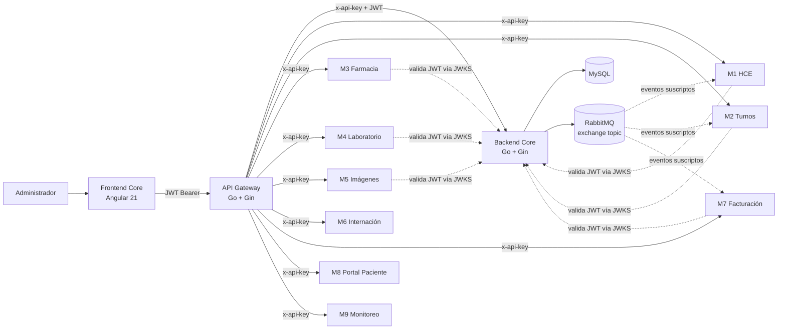
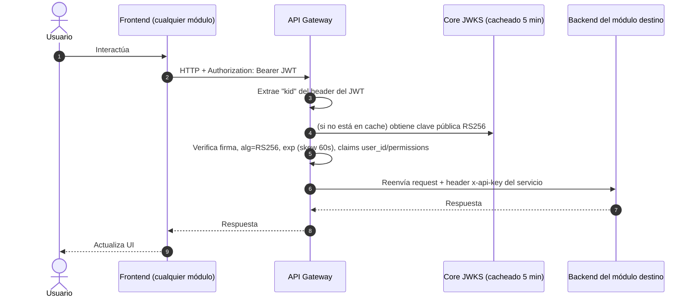
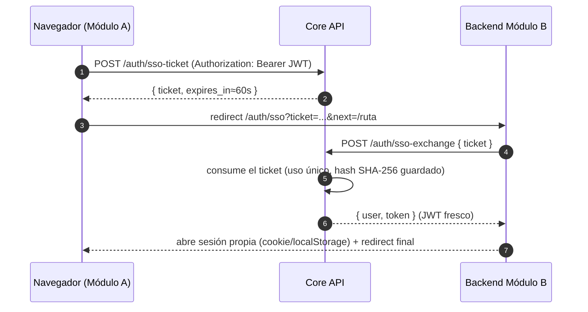

# Módulo 10 — Core (Identidad, Autorización y Bus de Eventos)

> **Proyecto:** Health Grid — Desarrollo de Aplicaciones II
> **Responsabilidad funcional:** identidad global de usuarios, autenticación (JWT + SSO), autorización por permisos, catálogo de roles/especialidades/ubicaciones, y bus de eventos (RabbitMQ) para integración asincrónica entre módulos. Además opera el **API Gateway** que centraliza el acceso a todos los microservicios de Health Grid.
> **Fecha de relevamiento del código:** 16 de julio de 2026.
> **Repositorios relevados:** `daii-core-main` (backend), `daii-gateway-main` (gateway), `health-grid-core-frontend-main` (frontend).
> **Estado documentado:** arquitectura implementada en el código entregado.

---

## 1. Objetivo y alcance del módulo

El Módulo 10 (Core) es el *bounded context* de identidad de Health Grid. Es la única fuente de verdad de usuarios, credenciales, roles, permisos, especialidades y ubicaciones/sedes. Todos los demás módulos delegan en él la autenticación de usuarios finales y validan los tokens que emite.

El alcance funcional implementado comprende:

1. **Autenticación:** registro, login, logout, refresh, recuperación de contraseña, verificación de cuenta por email.
2. **Autorización:** roles con permisos asociados (RBAC granular tipo `recurso:accion` y `recurso:accion:scope:{id}`).
3. **Gestión de catálogos:** usuarios, roles, permisos, especialidades médicas, ubicaciones/sedes.
4. **SSO cross-dominio:** tickets de un solo uso para propagar sesión entre frontends de distintos módulos que no comparten cookies.
5. **JWKS público:** expone la clave pública RSA para que cualquier módulo valide JWT RS256 localmente, sin llamar al Core en cada request.
6. **Bus de eventos (RabbitMQ):** catálogo de tipos de evento, suscripciones, log de eventos publicados, y aprovisionamiento de colas/bindings para los módulos consumidores.
7. **API Gateway:** reverse proxy único de entrada (`/api/*`) que valida el JWT y reenvía a cada microservicio con su propia API key.

### 1.1 Límites funcionales

El módulo **es dueño** de: identidad, credenciales, roles, permisos, especialidades (catálogo global), ubicaciones/sedes, tipos de evento y su bus de distribución.

El módulo **no es dueño** de: historia clínica (M1), turnos (M2), farmacia (M3), laboratorio (M4), imágenes (M5), internación (M6), facturación (M7), portal del paciente (M8), monitoreo (M9). Esos datos se referencian por `user_id`/`core_id` y se resuelven vía JWT o llamadas REST al Core.

---

## 2. Resumen ejecutivo de arquitectura

El Core está compuesto por **tres piezas independientes**, cada una en su propio repositorio y desplegable por separado:

- **Backend Core** (Go + Gin): identidad, autorización, bus de eventos. Persiste en MySQL.
- **API Gateway** (Go + Gin): punto de entrada único; valida JWT vía JWKS y hace reverse proxy hacia los 9 microservicios + el propio Core, inyectando una API key por servicio.
- **Frontend Core** (Angular 21): panel de administración de usuarios/roles/permisos/especialidades/ubicaciones, y punto de partida del SSO hacia el resto de los frontends de Health Grid.



### 2.1 Estilo arquitectónico

**Backend Core:**
```text
Router (Gin) → Handler → Service → Repository → MySQL
                                  → RabbitMQService (bus de eventos)
```

**Gateway:**
```text
Router (Gin) → CORS middleware → Auth middleware (JWKS local) → ReverseProxy(target, apiKey)
```

Es un gateway "delgado": no reimplementa lógica de negocio, solo valida el JWT del usuario final y reenvía con una API key propia de cada microservicio (defensa en profundidad: aunque alguien evada el Gateway, cada servicio exige su `x-api-key`).

---

## 3. Topología de despliegue y direccionamiento

### 3.1 Endpoints observados

| Componente | Dirección |
|---|---|
| Core API (directo) | `https://api.healthcare.cantero.ar` |
| API Gateway | `https://daii.nicopenaloza.com` (dominio del módulo `daii.nicopenaloza.com/api` en Go) |
| Frontend Core | `http://localhost:4200` (dev) — panel de administración |
| JWKS público | `GET /.well-known/jwks.json` (expuesto tanto por el Core directo como reenviado por el Gateway) |

### 3.2 Tabla de ruteo del Gateway

El Gateway monta todo bajo el prefijo `/api` y hace reverse proxy con `x-api-key` propia por servicio:

| Prefijo | Servicio destino | Variable de entorno (URL) | Auth requerida |
|---|---|---|---|
| `/api/auth/login`, `/register`, `/forgot-password`, `/reset-password` | Core | `CORE_SERVICE_URL` | Pública |
| `/api/auth/logout`, `/refresh`, `/validate`, `/verify-account` | Core | `CORE_SERVICE_URL` | JWT |
| `/api/core/*` | Core (resto de endpoints: users, roles, permissions, etc.) | `CORE_SERVICE_URL` | JWT |
| `/api/hce/*` | M1 HCE | `HCE_SERVICE_URL` | JWT |
| `/api/appointments/*` | M2 Turnos | `APPOINTMENTS_SERVICE_URL` | JWT |
| `/api/pharmacy/*` | M3 Farmacia | `PHARMACY_SERVICE_URL` | JWT |
| `/api/lab/*` | M4 Laboratorio | `LAB_SERVICE_URL` | JWT |
| `/api/imaging/*` | M5 Imágenes | `IMAGING_SERVICE_URL` | JWT |
| `/api/inpatient/*` | M6 Internación | `INPATIENT_SERVICE_URL` | JWT |
| `/api/billing/*` | M7 Facturación | `BILLING_SERVICE_URL` | JWT |
| `/api/portal/*` | M8 Portal del Paciente | `PORTAL_SERVICE_URL` | JWT |
| `/api/monitoring/*` | M9 Monitoreo | `MONITORING_SERVICE_URL` | JWT |
| `/.well-known/jwks.json` | Core | `CORE_SERVICE_URL` | Pública |

Cada backend de módulo recibe, además del JWT reenviado tal cual del cliente, un header `x-api-key` propio (`HCE_API_KEY`, `APPOINTMENTS_API_KEY`, etc.) inyectado por el Gateway — no por el frontend. Esto coincide con lo documentado por M1/M2/M7 sobre validación de `x-api-key` como capa adicional al JWT.

### 3.3 Flujo de una solicitud a través del Gateway



---

# PARTE I — FRONTEND (Core)

## 4. Arquitectura del frontend

### 4.1 Stack tecnológico

| Tecnología | Versión/uso |
|---|---|
| Angular | `21` |
| TypeScript | `~5.9` |
| RxJS | `~7.8` |
| lucide-angular | `^1.0` — iconografía |
| Vitest | `^4.0` — testing |

### 4.2 Estructura del código

```text
src/app/
├── core/
│   ├── auth/               # has-permission.directive.ts, permissions.ts
│   ├── services/           # auth, user, role, permission, speciality, location
│   ├── models/             # api.model.ts, user/role/permission/speciality/location.model.ts
│   ├── interceptors/       # auth.interceptor.ts — adjunta Bearer JWT
│   ├── guards/              # auth.guard.ts, permission.guard.ts
│   └── utils/               # jwt.ts, api-error.ts
├── features/
│   ├── auth/                # login, register, forgot-password, verify-account, sso
│   └── core/                 # users, roles, permissions, specialities, locations (ABM)
├── layout/                   # shell, sidebar, topbar, profile-edit-modal, change-password-modal
└── shared/ui/                # pagination, chips-input, modal, toast, confirm-delete, confirm-unsaved
```

### 4.3 Autorización en el frontend

`has-permission.directive.ts` + `permission.guard.ts` implementan control de UI/rutas por permiso, en línea con el RBAC granular del backend (`recurso:accion`).

### 4.4 SSO saliente hacia otros módulos

El frontend Core actúa como **punto de partida del SSO**: desde su sidebar/shell navega hacia los demás frontends de Health Grid usando las URLs de callback configuradas en `environment.ts`:

| Variable | Destino |
|---|---|
| `medicalRecordsSsoUrl` | `https://healthgrid-hce-frontend-olive.vercel.app/auth/sso` (M1) |
| `appointmentsSsoUrl` | `https://turnos.solefrancisco.com/auth/sso` (M2) |
| `pharmacySsoUrl` | `https://front-modulo3-farmacia.vercel.app/auth/sso` (M3) |
| `imagingSsoUrl` | `https://uade-da-2-frontend.vercel.app/auth/sso` (M5) |
| `inpatientSsoUrl` | `https://internaciones-y-camas.vercel.app/auth/sso` (M6) |
| `patientPortalSsoUrl` | `https://da2frontend.onrender.com/auth/sso` (M8) |

En producción, `apiBaseUrl` apunta directo a `https://api.healthcare.cantero.ar` (Core directo, sin pasar por el Gateway, para el propio panel de administración).

---

# PARTE II — BACKEND (Core API)

## 5. Arquitectura del backend

### 5.1 Stack tecnológico

| Tecnología | Uso |
|---|---|
| Go 1.25 | Lenguaje |
| Gin | Framework HTTP |
| MySQL (`go-sql-driver/mysql`) | Persistencia |
| `golang-jwt/jwt/v5` | Firma/verificación JWT RS256 |
| `amqp091-go` | Cliente RabbitMQ |
| `golang.org/x/crypto` | Hashing de contraseñas |
| swaggo | Documentación OpenAPI/Swagger |

### 5.2 Estructura del código

```text
cmd/server/main.go        # entry point: wiring manual de repos/services y rutas Gin
internal/
├── handlers/              # auth, user, role, permission, speciality, location, event, rabbit, generic
├── services/               # auth, user, role, permission, speciality, location, event, rabbit, rabbitmq, database, env, pagination
├── repository/              # implementaciones MySQL por entidad
├── interfaces/               # contratos de repositorio (para poder mockear/testear)
├── models/                    # entidades + DTOs de request/response
└── utils/                      # auth (hash/jwt), email (SMTP), location_validations
```

Capas: `Router (Gin) → Handler → Service → Repository → MySQL`, con `EventService` acoplado además a `RabbitMQService` para publicar eventos de forma asíncrona y no bloqueante.

### 5.3 Modelo de datos (MySQL)

Tablas principales: `users`, `credentials`, `roles`, `permissions`, `specialities`, `locations`, tablas puente `users_roles`, `roles_permissions`, `users_locations`, `users_specialities`, `verification_tokens`, `sso_tickets`, `event_types`, `event_subscriptions`, `event_log`.

No existe tabla de sesiones activas (comentario explícito en el schema: *"Active sessions table removed: JWTs are validated via JWKS and are stateless"*).

### 5.4 Autenticación JWT

**Decisión de diseño:** el Core es la **única autoridad** que emite JWT en todo Health Grid. Los demás módulos solo validan.

- Firma **RS256** con clave privada RSA 2048-bit generada automáticamente en el primer arranque (volumen `jwt_keys` en Coolify) — no se sube ninguna clave al repo.
- Clave pública expuesta en `GET /.well-known/jwks.json`, con `kid` en el header del token para soportar rotación.
- Claims: `user_id`, `permissions` (array de strings tipo `recurso:accion`), `iat`, `exp`.
- Validación **stateless**: cualquier módulo puede verificar la firma localmente cacheando el JWKS (`docs/JWKS_VALIDATION.md` incluye ejemplos en Go y Node.js para los demás equipos).
- `GET /auth/validate` disponible para revocación/estado de sesión cuando un módulo lo necesita.

### 5.5 Autorización (RBAC)

Permisos con formato `recurso:accion` (ej. `users:read`, `roles:manage`) y variantes con scope (`users:create:role:{id}`). Cada ruta protegida usa `PermissionMiddleware("<permiso>")` después de `AuthMiddleware`.

### 5.6 SSO cross-dominio (ticket de un solo uso)

Mecanismo para propagar sesión entre frontends que no comparten cookies (estilo CAS):



- El ticket viaja en la URL (bajo riesgo: expira en ~60s, un solo uso, el Core solo persiste su hash SHA-256).
- El JWT (credencial de 24h) nunca aparece en la URL — se canjea servidor-a-servidor.
- Esta es la guía que **el resto de los módulos** (M1–M9) deben implementar del lado "destino"; varios ya la referencian (M4, M5) como "navegación SSO desde el ASIDE".

### 5.7 Bus de eventos (RabbitMQ)

**Modelo:** exchange único `health_grid_exchange` (tipo `topic`) + dead-letter exchange `health_grid_dlx` (tipo `direct`). El *routing key* de cada mensaje es el **nombre del tipo de evento** (`event_types.name`).

**Flujo de publicación (`POST /events/log`):**
1. Se valida que el `event_type_id` exista.
2. Se persiste el evento en `event_log` con estado `pending`.
3. Se publica a RabbitMQ **de forma asíncrona** (goroutine, no bloqueante); si falla, el log queda en `pending` para reintento manual y no revierte la operación que originó el evento — mismo patrón "no bloqueante" que documentaron M1, M2 y M7 para sus integraciones salientes.
4. Si publica OK, se actualiza el estado a `delivered`; si falla, a `failed`.

**Aprovisionamiento de colas (self-service para otros módulos):**
- `POST /rabbit/queues` — un módulo autenticado crea su propia cola (`{nombre}.requests` o `{nombre}.responses`) con su DLQ asociada, y recibe permiso de lectura sobre ella (usa la Management API de RabbitMQ, identificando al usuario Rabbit por el `email` del usuario del Core).
- `POST /rabbit/bindings` — bindea una cola existente a un tipo de evento (routing key), validando que el usuario tenga permiso de lectura sobre esa cola antes de bindearla.
- Reconexión automática con backoff ante caídas transitorias de RabbitMQ; si RabbitMQ no está disponible al arrancar, el Core sigue funcionando y el bus de eventos opera "solo con auditoría en BD" (degradación explícita, documentada en el propio README).

Este es el mecanismo que consumen M2 (cola `hce.requests`/`appointments.requests`) y M7 (eventos de M6 vía RabbitMQ) según sus propios documentos de arquitectura.

### 5.8 Endpoints principales

| Grupo | Rutas | Público / Protegido |
|---|---|---|
| Auth | `/auth/register`, `/login`, `/forgot-password`, `/reset-password`, `/.well-known/jwks.json` | Público |
| Auth | `/auth/validate`, `/refresh`, `/logout`, `/sso-ticket`, `/sso-exchange`, `/verify-account` | JWT (algunas) |
| Usuarios | `/users`, `/users/:id`, `/users/:id/roles`, `/users/:id/locations`, `/users/:id/specialities`, `/users/:id/password` | JWT + permiso |
| Roles / Permisos | `/roles`, `/permissions` (+ sub-rutas de asignación) | JWT + permiso |
| Especialidades / Ubicaciones | `/specialities`, `/locations` | JWT + permiso |
| Eventos | `/events/types`, `/events/subscriptions`, `/events/log` | JWT + permiso |
| RabbitMQ | `/rabbit/queues`, `/rabbit/bindings` | JWT |

Swagger disponible en `/swagger/index.html`.

---

# PARTE III — API GATEWAY

## 6. Arquitectura del Gateway

### 6.1 Stack tecnológico

Go + Gin (repositorio independiente, `daii.nicopenaloza.com/api`), sin dependencias de negocio — es un componente puramente de infraestructura.

### 6.2 Responsabilidades

1. **Único punto de entrada público** (`/api/*`) para todos los frontends de Health Grid.
2. **Validación de JWT RS256** contra el JWKS del Core, con cache en memoria (TTL configurable, default 5 min) y resolución por `kid`.
3. **Reverse proxy** hacia cada microservicio, agregando un header `x-api-key` propio por servicio (no expuesto nunca al frontend).
4. **CORS centralizado** — un único middleware para todos los módulos, configurable por `ALLOWED_ORIGINS` (o `*`).

### 6.3 Configuración por variables de entorno

Cada microservicio tiene su propio par `<SERVICE>_SERVICE_URL` / `<SERVICE>_API_KEY` (ver tabla de ruteo en §3.2), con valores por defecto apuntando a `localhost:300X` para desarrollo local — patrón consistente con lo que otros módulos (M2, M7) esperan recibir vía Gateway (`x-api-key` de entrada validado del lado de cada backend).

---

## 7. Contratos de integración con otros módulos

### 7.1 Lo que el Core provee a todo Health Grid

| Contrato | Consumidores |
|---|---|
| `GET /.well-known/jwks.json` | Todos los módulos (validación local de JWT RS256) |
| `GET /auth/validate` | Módulos que necesiten revocación/estado de sesión (ej. M4 lo usa como fallback) |
| `POST /auth/sso-ticket` + `POST /auth/sso-exchange` | Todos los frontends (SSO cross-dominio) |
| Login de servicio (`/auth/login` con credenciales de servicio por módulo) | M2, M3 (cuentas de servicio para llamar a otros módulos con su propio token) |
| Bus de eventos (`/events/log`, `/rabbit/queues`, `/rabbit/bindings`) | M1 (Core Bus), M2 (`appointments.requests`), M7 (eventos de M6) |
| Gateway (`/api/*`) | Todos los frontends |

### 7.2 Lo que el Core espera de los demás módulos

- Cada backend valida el JWT (localmente vía JWKS, o contra `/auth/validate`) y respeta los `permissions` del claim.
- Cada backend implementa su propio callback `/auth/sso` para consumir el flujo de ticket descripto en §5.6.
- Cada backend acepta el header `x-api-key` que le inyecta el Gateway (según lo ya implementado por M1, M2 y M7).

---

## 8. Decisiones de diseño clave

| Decisión | Justificación |
|---|---|
| Go + Gin en Core y Gateway | Rendimiento y binarios simples de desplegar; separa infraestructura (Gateway) de negocio (Core) |
| JWT RS256 con clave autogenerada en volumen | Ningún secreto compartido entre módulos; rotación simple eliminando el volumen |
| JWKS público + validación local en cada módulo | Evita que el Core sea un cuello de botella en cada request de todo el sistema |
| Sesiones stateless (sin tabla de sesiones) | Simplifica escalado horizontal del Core |
| SSO por ticket de un solo uso (no JWT en la URL) | Evita exponer una credencial de 24h en historial/logs/Referer al cruzar dominios |
| Gateway con API key por microservicio | Defensa en profundidad: un servicio nunca es alcanzable solo con un JWT válido, también requiere venir del Gateway |
| RabbitMQ con degradación a "solo auditoría en BD" | El Core no cae si RabbitMQ no está disponible; los eventos quedan en `pending` para reintento |
| Exchange topic único + routing key = nombre del evento | Cualquier módulo puede suscribirse a eventos nuevos sin cambios en el Core, solo bindeando su cola |
| Self-service de colas/bindings vía API | Cada equipo de módulo provisiona su propia integración sin depender de que el equipo Core lo haga a mano |

---

## 9. Riesgos y deuda técnica identificada

1. **Gateway sin lista blanca de rutas por servicio:** usa `Any("/*path", ...)`, por lo que cualquier ruta expuesta por un backend de módulo queda accesible vía Gateway sin control adicional de método/recurso a ese nivel (el control fino queda en cada backend).
2. **CORS del Gateway por defecto `*`** si no se configura `ALLOWED_ORIGINS` — a ajustar en producción.
3. **Reintento de eventos `failed`/`pending`** en el bus: el Core los marca pero no hay un job automático de reintento — hoy es manual.

---

## 10. Recomendaciones para el documento general

Identificador sugerido en diagramas globales:

```text
M10 — Core (Identidad, Autorización, Bus de Eventos) + Gateway
```

Componentes a representar como nodos separados en el diagrama unificado:

```text
Frontend Core (Angular) | API Gateway (Go) | Backend Core (Go) | MySQL | RabbitMQ (exchange health_grid_exchange)
```

Todas las flechas de "login/SSO/JWKS" de los demás módulos hacia "Core" en sus propios diagramas deben apuntar a este componente.

---

## 11. Glosario del módulo

| Término | Definición |
|---|---|
| **JWKS** | JSON Web Key Set — conjunto de claves públicas para validar JWT, expuesto en `/.well-known/jwks.json`. |
| **kid** | Key ID, identifica qué clave del JWKS firmó un token dado (soporta rotación). |
| **Ticket SSO** | Credencial opaca, de un solo uso, vigencia ~60s, para transportar sesión entre dominios sin exponer el JWT. |
| **Routing key** | En RabbitMQ, cadena usada para enrutar mensajes desde el exchange a las colas bindeadas; acá es el nombre del tipo de evento. |
| **DLX / DLQ** | Dead-Letter Exchange / Queue — destino de mensajes que no pudieron procesarse. |
| **RBAC** | Control de acceso basado en roles: usuario → roles → permisos. |
